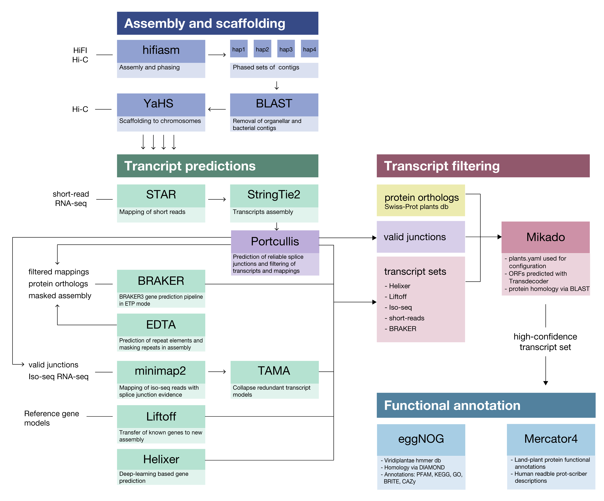

# Désirée potato genome

By using PacBio HiFi and Hi-C data only we were able to generate phased chromosome-level assembly of a tetraploid potato cultivar. This repository contains scripts and supplementary information on the assembly and gene annotation process.

## Download

 Genome assembly and annotation files are available at [Zenodo](https://doi.org/10.5281/zenodo.14609304) and [desiree.nib.si](https://desiree.nib.si)

## Pipeline overview

 

 Commands used to generate the assembly and annotation are located in [`scripts`](https://github.com/NIB-SI/desiree-genome/tree/main/scripts).

1. `assembly.txt` - assembly of initial phased sets of contigs with *hifiasm*
2. `scaffolding.txt` - scaffolding to chromosomes with *YaHs*
3. `annotation.txt` - gene annotation pipeline

## Citation
If you are using this genome in your research, please cite:

**Haplotype-resolved genome assembly of the tetraploid potato cultivar Desiree**  
Godec T, Beier S, Rodriguez-Granados N, Sasidharan R, Abdelhakim L, Teige M, Usadel B, Gruden K, Petek M,  
*bioRxiv 2025.01.14.631659*  
doi: https://doi.org/10.1101/2025.01.14.631659

